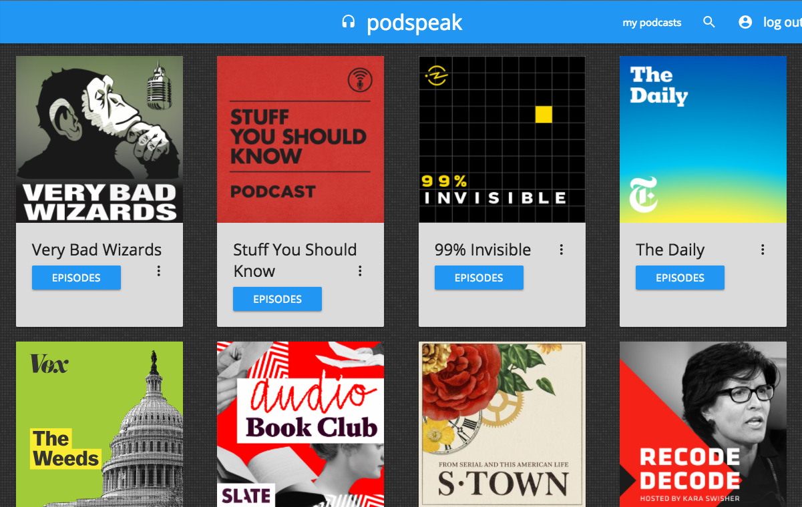
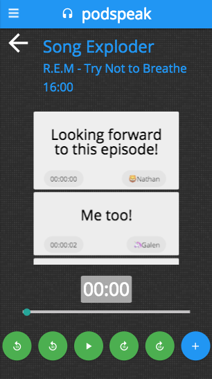

# **PODSPEAK**

Podspeak makes listening to podcasts into an interactive experience by allowing users to comment on episodes in a twitter-like feed. The application allows users to browse, discover, and play podcasts, drawing the most recent episodes from rss feeds and syncing comments with a database using graphQL.

Check out a live demo: [podspeak](http://podspeak.surge.sh)

* Browse podcasts.
* Search for and discover new podcasts using ListenNotes API.
* Read and leave comments on episodes.

* Comments are linked to timestamp and they only load within the current minute that a podcast is being played.
* This feature allows users to engage in 'async' conversations.

# Frontend features:
* React
* Apollo Client
* React Router
* PubSub-JS
* Materialize CSS
* React-player

#Backend features:
* Node.js / Express
* Auth: JWT/bcrypt
* graphQL
* postgreSQL / Knex.js
* API for podcast search: ListenNotes
* RSS feedparser

# Instructions for use

Just clone down the frontend from this repo and install with npm install. If you want to check out the backend, take a look at [https://github.com/nathandpeterson/podspeak-api].
